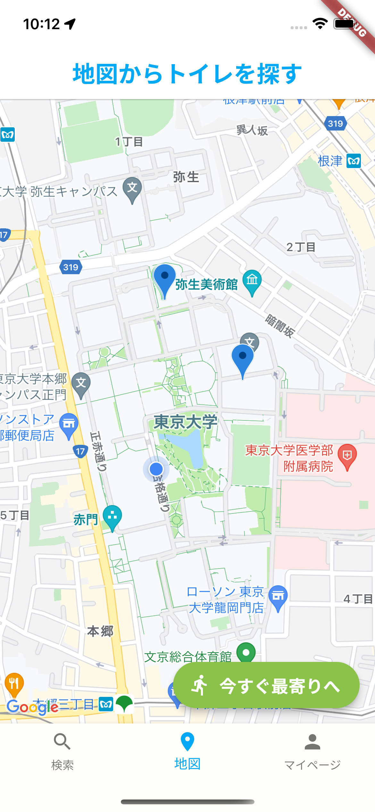
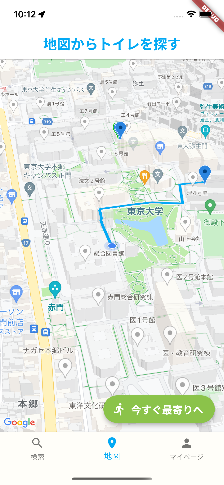

# UToilet


App that tells you where the nearest vacant toilet is on Hogo campus of the University of Tokyo.

## Urgent situation



If you are in a dire situation, this app will help you a lot. This app will guide you to the nearest restroom **immediately**.

Press the **Get nearest now** button and the app shows the route to the nearest restroom on the map!

This app will help you even after you get to the building! This can also guide you to the shortest route from the building entrance to the restrooms.

## Find the favorite toilets



Set your preferences and only the restrooms that meet your criteria will be displayed on the map.

You can also save your favorite restrooms. It is possible to go to your favorite restrooms whenever!.

**Comfortable toilet life!**

## API settings

### Android setup

Navigate to the file `android/app/src/main/AndroidManifest.xml` and replace the `YOUR KEY HERE` tag:

```xml
<!-- Add your Google Maps API Key here -->
<meta-data android:name="com.google.android.geo.API_KEY"
               android:value="YOUR KEY HERE"/>
```

### ios setup

Navigate to the file `ios/Runner/AppDelegate.swift` and replace the `YOUR KEY HERE`:

```swift
import UIKit
import Flutter
import GoogleMaps

@UIApplicationMain
@objc class AppDelegate: FlutterAppDelegate {
  override func application(
    _ application: UIApplication,
    didFinishLaunchingWithOptions launchOptions: [UIApplication.LaunchOptionsKey: Any]?
  ) -> Bool {
    GeneratedPluginRegistrant.register(with: self)

    // Add your Google Maps API Key here
    GMSServices.provideAPIKey("YOUR KEY HERE")

    return super.application(application, didFinishLaunchingWithOptions: launchOptions)
  }
}
```

### commmon setup

Navigate to the file `lib/.env.dart` and replace the `YOUR KEY HERE`:

```dart
import 'package:flutter/material.dart';

// Add your Google Maps API Key here
const String googleAPIKey = 'YOUR KEY HERE';
```

This completes the setup for both the platforms in flutter.
