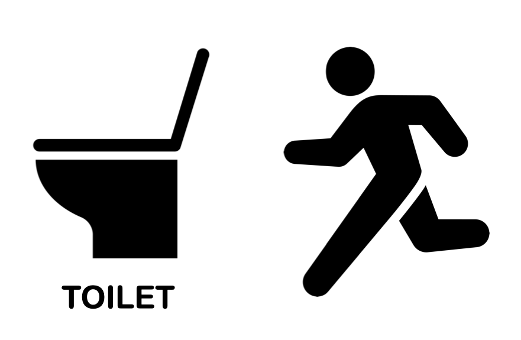
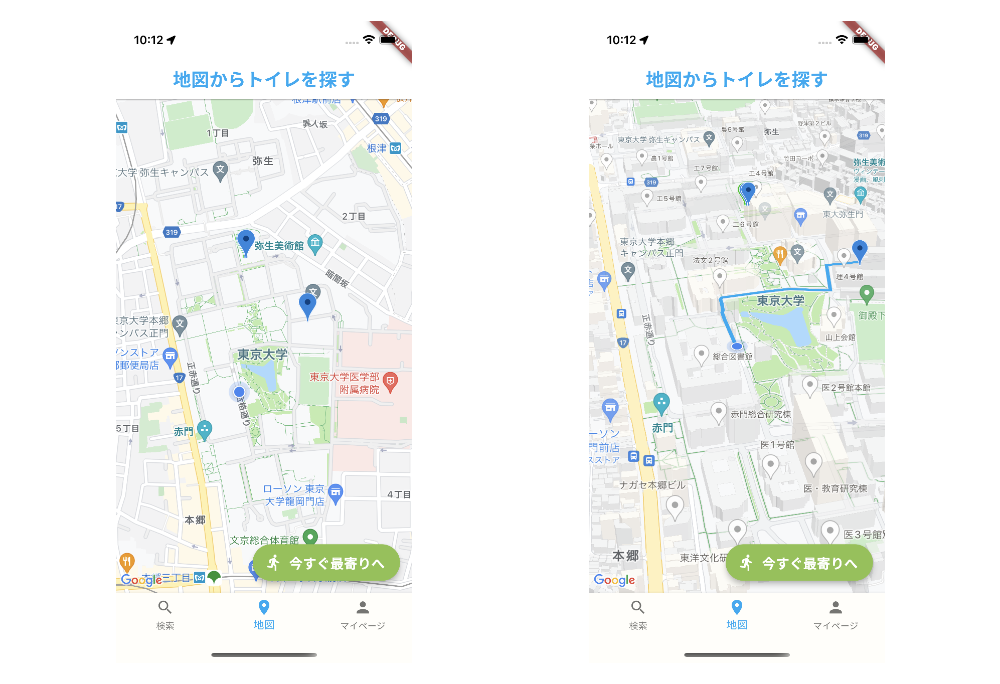
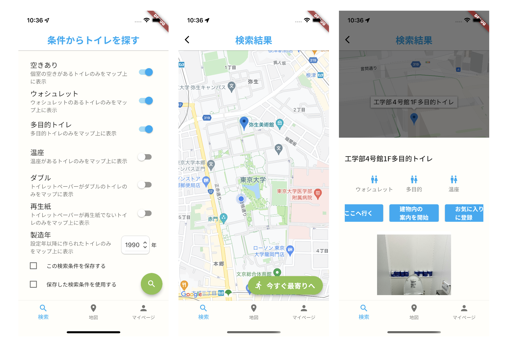

# UToilet

App that tells you where the nearest vacant toilet is on Hogo campus of the University of Tokyo.

## Urgent situation

If you are in a dire situation, this app will help you a lot. This app will guide you to the nearest restroom **immediately**.

Press the **Get nearest now** button and the app shows the route to the nearest restroom on the map!

This app will help you even after you get to the building! This can also guide you to the shortest route from the building entrance to the restrooms.

## Find the favorite toilets

&nbsp

&nbsp

Set your preferences and only the restrooms that meet your criteria will be displayed on the map.

You can also save your favorite restrooms. It is possible to go to your favorite restrooms whenever!.

**Comfortable toilet life!**
